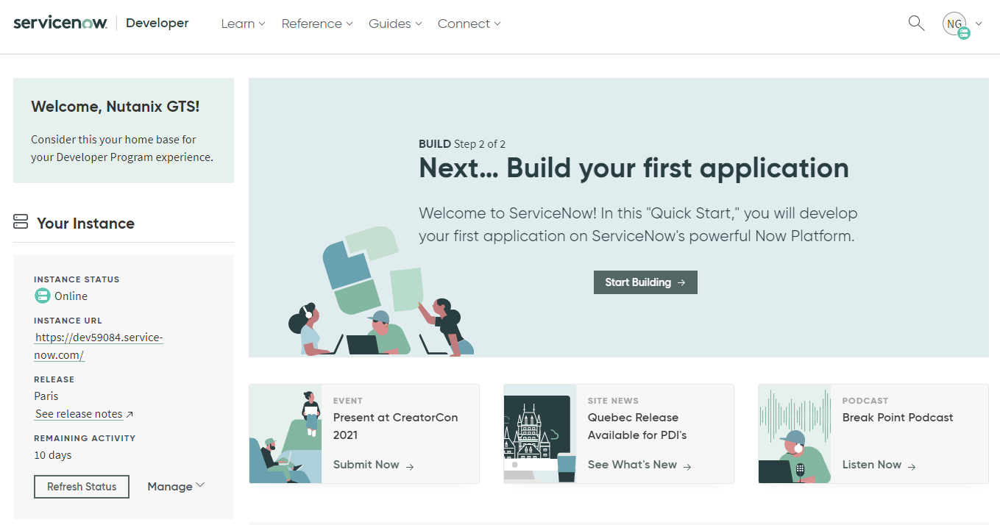

.. _snow_gettingstarted:

---------------
Getting Started
---------------

This Bootcamp is designed to showcase Nutanix as an ideal platform for self-service IaaS, leveraging the platform benefits of Nutanix AOS and Calm, and integration with IT service management platform, ServiceNow.

In this scenario, you are working with a party supply manufacturing and distribution business that has been heavily impacted by the COVID-19 pandemic. They are looking to pivot away from brick and mortar and ramp up their eCommerce offerings, including entertainment and gaming services to spice up Zoom parties, and planning services to re-invigorate safe and socially distant in-person gatherings. They are hiring new app developers and signing contracts with consultants daily. Unfortunately, the existing IT team has been unable to keep up with the demands of the growing team.

In addition to quickly providing more capacity for workloads, they must also provide self-service access for developers to maintain peak efficiency and bring new offerings to market quickly. As their business now solely depends on the uptime of their infrastructure, backup and disaster recovery are critical design components - as is ensuring workloads remain secure regardless of where they run in the environment. Finally, automating infrastructure remediation for user issues will help the IT scale operations to support their new influx of internal customers.

Environment Staging
+++++++++++++++++++

To let you experience the most fun and interesting parts of the lab, as well as accommodate the large number of simultaneous users, multiple components have already been staged for you. *Let's explore!*

ServiceNow
..........

The larger and more diverse an organization’s IT environment is, the more they need robust IT process to mitigate and manage risk. The need to follow agreed and approved processes is paramount when organizations are running critical business applications on which things like corporate profit, human lives, or financial markets may depend.

IT organizations want to find a simple way for all end-users to get IT services via a singe portal, and they want everything automated! With many platforms in the mix, **ServiceNow is where they all come together so IT organizations can have one set of processes for all platforms**.

To simplify and accelerate developing new apps and integrations for the platform, ServiceNow `provides free developer instances of its entire platform <https://developer.servicenow.com/>`_ to users - *these instances are great for labs and demos too!*

In addition to your Nutanix cluster, each group of users will share a **pre-staged** ServiceNow Developer Instance. We'll cover more about the environment throughout the labs.

